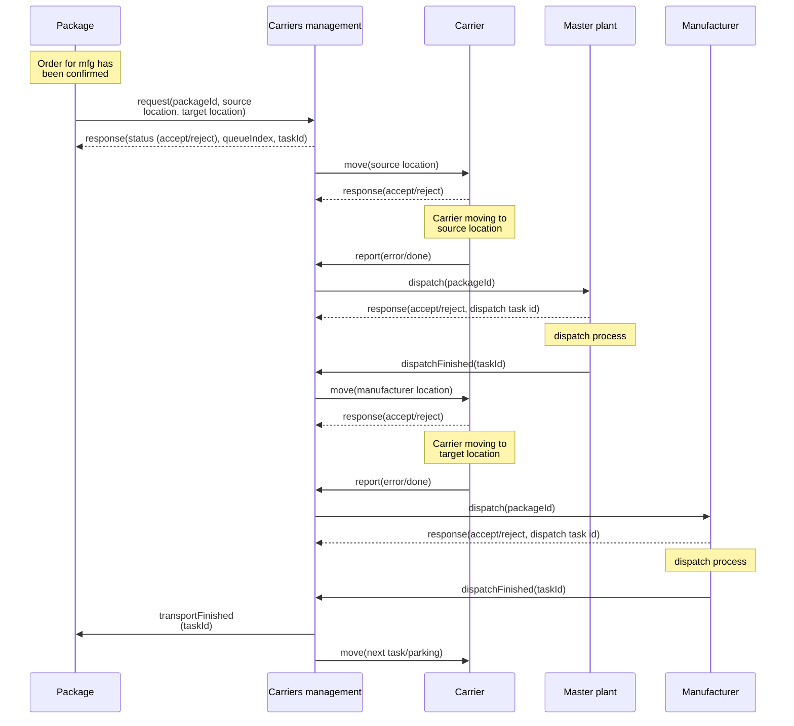

# shr-mfg-platform


by Tomaž:
* HTTP server za robotsko roko: https://github.com/fsprojekti/shr-mfg-robotic-arm-http-server
	* aplikacija narejena in stestirana
* Arduino aplikacija za vožnjo avtomobilčkov: https://github.com/fsprojekti/df_micro_maqueen-mbits-esp32_arduino_app
	* koda v glavnem napisana, ni pa še resno stestirana - čaka se dobava esp32 boardov
* Node.js nadzorna aplikacija za avtomobilčke: https://github.com/fsprojekti/df-micro-maqueen-robot-cars-control-app
	* koda skoraj napisana, delno stestirana
	
```mermaid
graph TD

subgraph ML[Management layer]
    MCM[Multiple carriers management ]
    MPM[Multiple packages management]
end
subgraph CL[Communication layer]
    subgraph CL1[HTTP servers]
    CC[Carrier]
    CM[Master plant]
    CMFG[Manufacturing plant]
    CMC[Multiple carriers]
    CMP[Multiple packages]


    end
    
end
subgraph AL[Control layer]
    CTM[Master plant app]
    CTC[Carrier app]
    CTMFG[Manufacturing plant app]
   
end
subgraph PL[Physical layer]
    subgraph PL1[ESP Microbit]
    PC[Carrier]
    end
   
    subgraph PL2[JetMax robotic arm]
        PMFG[Manufacturing plant]
        PM[Master plant]
    end
    P[Packages]
end

CMFG---CTMFG---PMFG
CM---CTM---PM

MPM---CMP---P

MCM---|HTTP API|---CMC---CC---CTC---PC


style CL fill:#FAD7A0, stroke:#F5B041
style PL fill:#AED6F1, stroke:#3498DB
style ML fill:#ABEBC6, stroke:#28B463
style AL fill:#D7BDE2, stroke:#884EA0


```

# Communication between nodes



# Blockchain layer

# Management layer
## Multiple carriers management
## Multiple packages management

# Communication layer

## Carrier HTTP API

| API endpoint | description | parameter(s) | returns |
| ------------ | ----------- | ------------ | ------- |
| <code>/move</code> | Move from source to target location | <code>msg={"source": a, "target" = b, "taskId"=? }</code> |{success/error}|

Carrier Arduino app: https://github.com/fsprojekti/df_micro_maqueen-mbits-esp32_arduino_app

## Multiple carriers HTTP API

| API endpoint | description | parameter(s) | returns |
| ------------ | ----------- | ------------ | ------- |
| <code>/request</code> | Request transportation of package. Request goes to queue as task | <code>msg={"source": a, "target" = b, "packageId" = c}</code> |{status (accept, reject), queueIndex, taskId}|
| <code>/report</code> | Report on state of the task | <code>msg={"taskId": a, "state" = error/done }</code> ||
| <code>/getTask</code> | Get state of the task | <code>msg={"taskId": a }</code> |{task state}|

Carrier management Node.js application: https://github.com/fsprojekti/df-micro-maqueen-robot-cars-control-app

## Master plant HTTP API
## Manufacturing plant HTTP API
## Multiple packages HTTP API

| API endpoint | description | parameter(s) | returns |
| ------------ | ----------- | ------------ | ------- |
| <code>/transportFinished</code> | Infor the package that the transport was successfully finished | <code>msg={"taskId": a</code> |{success/error}|

# Control layer
## Carrier control app

Carrier Arduino app: https://github.com/fsprojekti/df_micro_maqueen-mbits-esp32_arduino_app

## Master plant control app
## Manufacturing plant control app


