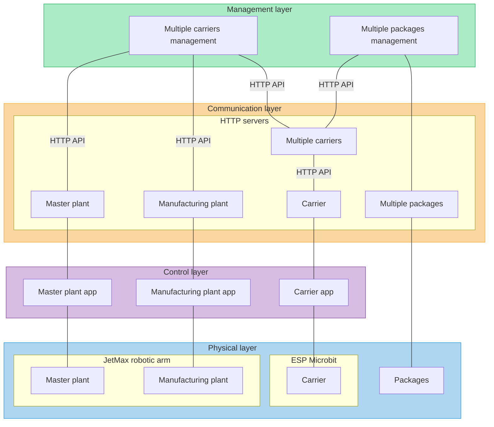
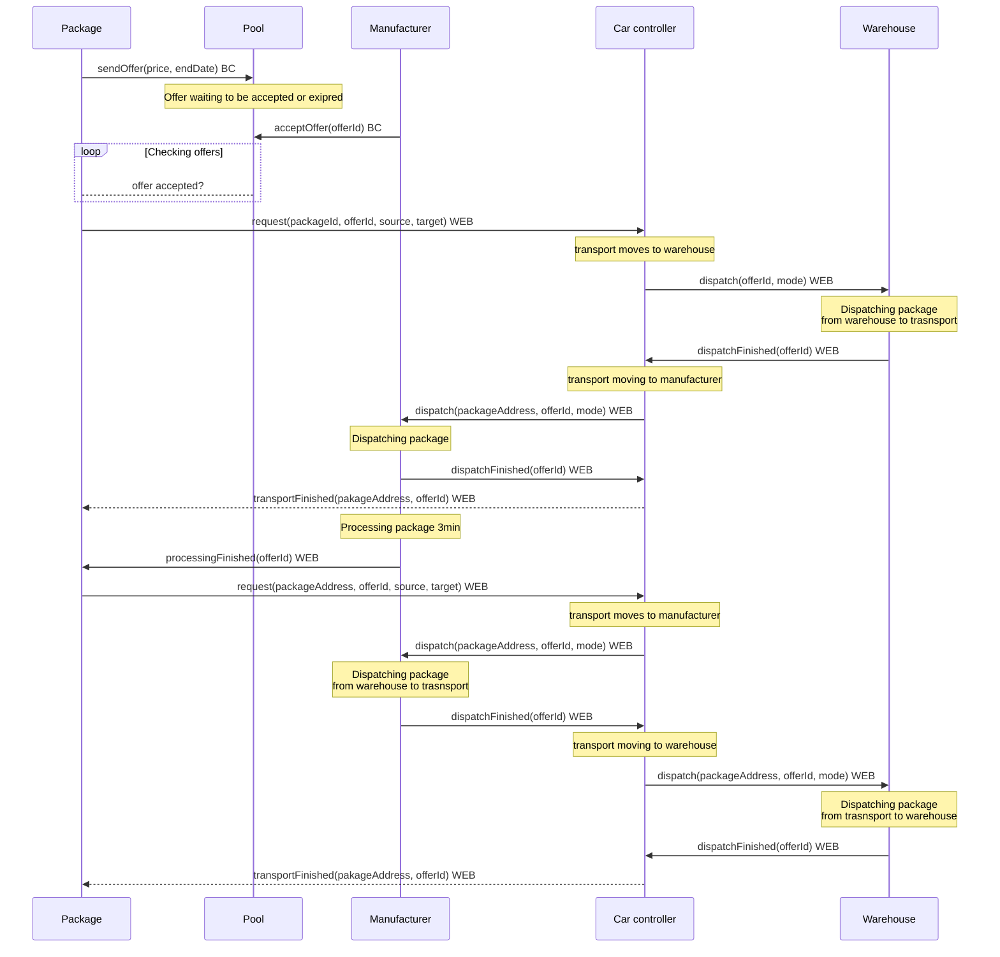

# Shared Manufacturing Platform

# Communication between nodes

The diagram shows an example of communication when the package is transported from the master plant (warehouse) to one of the manufacturing plants. A similar sequence is used when the package is transported in the opposite direction.

# Blockchain layer

# Management layer
## Multiple carriers management
* maintains a queue of active requests
* maintains data of active robot cars, manufacturing plants and master plant (warehouse)
* periodically processes requests on a first-come, first-served basis
* randomly selects an available car for transport and requests the move
* requests a dispatch at a plant
* after the transport finishes sends the car to the parking area

## Multiple packages management

# Communication layer

## Carrier HTTP API

| API endpoint | description | parameter(s) | returns |
| ------------ | ----------- | ------------ | ------- |
| <code>/move</code> | Move from source to target location | <code>msg={"source": a, "target" = b, "taskId"=? }</code> |{accept/reject}|

## Multiple carriers HTTP API

| API endpoint | description | parameter(s) | returns |
| ------------ | ----------- | ------------ | ------- |
| <code>/request</code> | Request transportation of package. Request goes to queue as task | <code>msg={"source": a, "target" = b, "packageId" = c}</code> |{status (accept, reject), queueIndex, taskId}|
| <code>/report</code> | Report on state of the task | <code>msg={"taskId": a, "state" = error/done }</code> ||
| <code>/getTask</code> | Get state of the task | <code>msg={"taskId": a }</code> |{task state}|

## Master plant HTTP API
## Manufacturing plant HTTP API
## Multiple packages HTTP API

| API endpoint | description | parameter(s) | returns |
| ------------ | ----------- | ------------ | ------- |
| <code>/transportFinished</code> | Infor the package that the transport was successfully finished | <code>msg={"taskId": a</code> |{success/error}|

# Control layer
## Carrier control app
* Arduino application for DFRobot micro:Maqueen Plus controlled by Mbits ESP32 microcontroller
* manages the movement of the robot car
* movements depend on a pre-defined grid
* each move is defined by a start (source) and end (target) location
* the car always drives in anti-clockwise direction
* the app assumes one of six crossroad variants as seen below

	* variant 1: compulsory left turn (grid outside corners)
	* variant 2: compulsory right turn (car coming out of the parking area)
	* variant 3: turn left (if coming out of the parking area) or turn right (if coming out of the plant area)
	* variant 4: turn left if this is the correct parking area (counter)
	* variant 5: turn right if this is the correct plant (counter)
	* variant 6: stop (at the plant or at the parking area
	

## Master plant control app
## Manufacturing plant control app

---

# Applications
## JetMax Robotic Arm HTTP server: 

Repository: https://github.com/fsprojekti/shr-mfg-robotic-arm-http-server
## Carrier management Node.js application: 

Repository: https://github.com/fsprojekti/df-micro-maqueen-robot-cars-control-app

## Carrier Arduino app:

Repository: https://github.com/fsprojekti/df_micro_maqueen-mbits-esp32_arduino_app

## Package management app:

Repository: https://github.com/fsprojekti/shr-mfg-platform-packages

## Smart contracts:

Repository: https://github.com/fsprojekti/shr-mfg-platforms-smart-contracts

