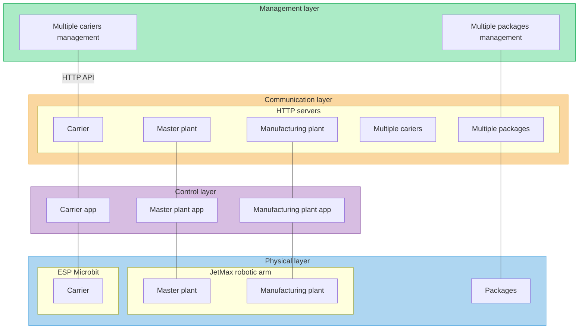

# shr-mfg-platform

by Tomaž:
* HTTP server za robotsko roko: https://github.com/fsprojekti/shr-mfg-robotic-arm-http-server
	* aplikacija narejena in stestirana
* Arduino aplikacija za vožnjo avtomobilčkov: https://github.com/fsprojekti/df_micro_maqueen-mbits-esp32_arduino_app
	* koda v glavnem napisana, ni pa še resno stestirana - čaka se dobava esp32 boardov
* Node.js nadzorna aplikacija za avtomobilčke: https://github.com/fsprojekti/df-micro-maqueen-robot-cars-control-app
	* koda skoraj napisana, delno stestirana
	

# Blockchain layer

# Management layer
## Multiple carriers managment
## Multiple packages managment

# Communication layer

## Carrier HTTP API
## Multiple carriers HTTP API
## Master plant HTTP API
## Manufacturing plant HTTP API
## Multiple packages HTTP API

# Control layer
## Carrier control app
## Master plant control app
## Manufacturing plant control app

