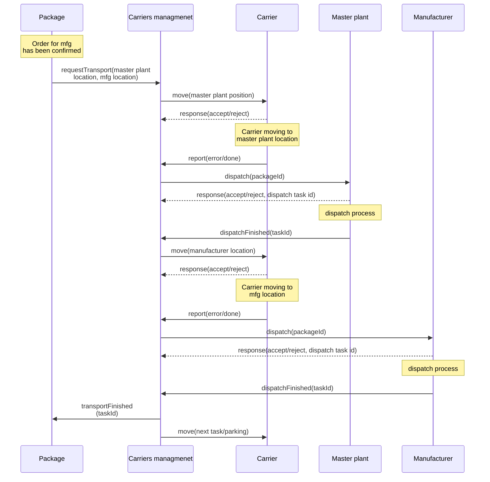

# shr-mfg-platform

by Tomaž:
* HTTP server za robotsko roko: https://github.com/fsprojekti/shr-mfg-robotic-arm-http-server
	* aplikacija narejena in stestirana
* Arduino aplikacija za vožnjo avtomobilčkov: https://github.com/fsprojekti/df_micro_maqueen-mbits-esp32_arduino_app
	* koda v glavnem napisana, ni pa še resno stestirana - čaka se dobava esp32 boardov
* Node.js nadzorna aplikacija za avtomobilčke: https://github.com/fsprojekti/df-micro-maqueen-robot-cars-control-app
	* koda skoraj napisana, delno stestirana
	

# Communication between nodes

# Blockchain layer

# Management layer
## Multiple carriers management
## Multiple packages management

# Communication layer

## Carrier HTTP API

| API endpoint | description | parameter(s) | returns |
| ------------ | ----------- | ------------ | ------- |
| <code>/move</code> | Move from source to target location | <code>msg={"source": a, "target" = b, "taskId"=? }</code> |{success/error}|

## Multiple carriers HTTP API

| API endpoint | description | parameter(s) | returns |
| ------------ | ----------- | ------------ | ------- |
| <code>/request</code> | Request transportation of package. Request goes to queue as task | <code>msg={"source": a, "target" = b}</code> |{queue index, taskId}|
| <code>/report</code> | Report on state of the task | <code>msg={"taskId": a, "state" = error/done }</code> ||
| <code>/gettask</code> | Get state of the task | <code>msg={"taskId": a }</code> |{task state}|

## Master plant HTTP API
## Manufacturing plant HTTP API
## Multiple packages HTTP API

| API endpoint | description | parameter(s) | returns |
| ------------ | ----------- | ------------ | ------- |
| <code>/request</code> | Request transportation of package. Request goes to the queue as a task. | <code>msg={"source": a, "target" = b}</code> |{queue index, taskId}|
| <code>/report</code> | Report on the state of the task. | <code>msg={"taskId": a, "state" = error/done }</code> ||
| <code>/getTask</code> | Get the state of the task. | <code>msg={"taskId": a }</code> |{task state}|

# Control layer
## Carrier control app
## Master plant control app
## Manufacturing plant control app

