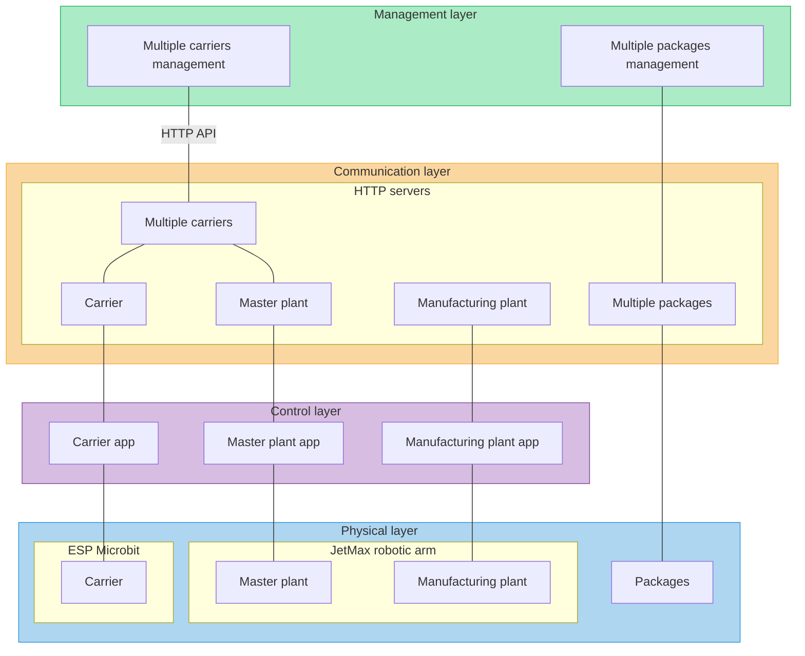
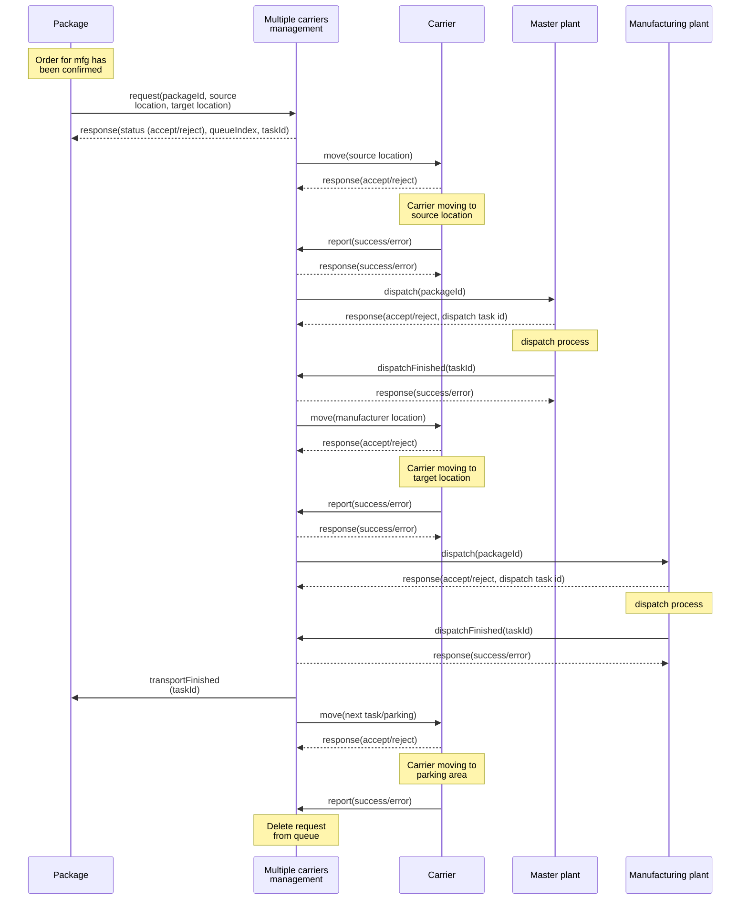

# Shared Manufacturing Platform

# Communication between nodes

The diagram shows an example of communication when the package is transported from the master plant (warehouse) to one of the manufacturing plants. A similar sequence is used when the package is transported in the opposite direction.

# Blockchain layer

# Management layer
## Multiple carriers management
## Multiple packages management

# Communication layer

## Carrier HTTP API

| API endpoint | description | parameter(s) | returns |
| ------------ | ----------- | ------------ | ------- |
| <code>/move</code> | Move from source to target location | <code>msg={"source": a, "target" = b, "taskId"=? }</code> |{accept/reject}|

## Multiple carriers HTTP API

| API endpoint | description | parameter(s) | returns |
| ------------ | ----------- | ------------ | ------- |
| <code>/request</code> | Request transportation of package. Request goes to queue as task | <code>msg={"source": a, "target" = b, "packageId" = c}</code> |{status (accept, reject), queueIndex, taskId}|
| <code>/report</code> | Report on state of the task | <code>msg={"taskId": a, "state" = error/done }</code> ||
| <code>/getTask</code> | Get state of the task | <code>msg={"taskId": a }</code> |{task state}|

## Master plant HTTP API
## Manufacturing plant HTTP API
## Multiple packages HTTP API

| API endpoint | description | parameter(s) | returns |
| ------------ | ----------- | ------------ | ------- |
| <code>/transportFinished</code> | Infor the package that the transport was successfully finished | <code>msg={"taskId": a</code> |{success/error}|

# Control layer
## Carrier control app

## Master plant control app
## Manufacturing plant control app

---

# Applications
## JetMax Robotic Arm HTTP server: 

Repository: https://github.com/fsprojekti/shr-mfg-robotic-arm-http-server
## Carrier management Node.js application: 

Repository: https://github.com/fsprojekti/df-micro-maqueen-robot-cars-control-app

## Carrier Arduino app:

Repository: https://github.com/fsprojekti/df_micro_maqueen-mbits-esp32_arduino_app

